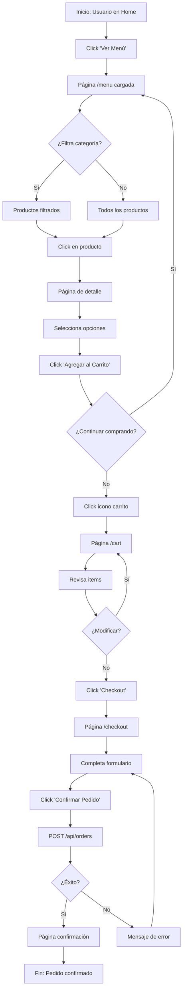
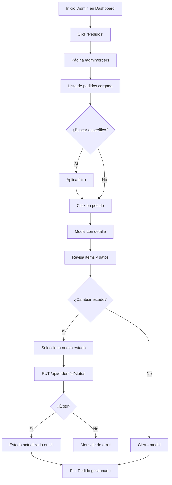
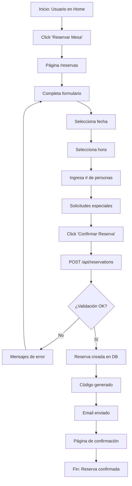

# Product Requirements Document (PRD)
# Pumainca Restobar - Sistema de Gestión Digital

**Versión:** 1.1  
**Fecha:** 31 de Enero, 2026  
**Autor:** Equipo Pumainca  
**Estado:** Implementado / En Producción

---

## 📑 Tabla de Contenidos

1. [Resumen Ejecutivo](#resumen-ejecutivo)
2. [Visión del Producto](#visión-del-producto)
3. [Objetivos del Producto](#objetivos-del-producto)
4. [Usuarios Objetivo](#usuarios-objetivo)
5. [Características y Funcionalidades](#características-y-funcionalidades)
6. [Requisitos Técnicos](#requisitos-técnicos)
7. [Arquitectura del Sistema](#arquitectura-del-sistema)
8. [Flujos de Usuario](#flujos-de-usuario)
9. [Diseño y Experiencia de Usuario](#diseño-y-experiencia-de-usuario)
10. [Modelo de Datos](#modelo-de-datos)
11. [APIs y Endpoints](#apis-y-endpoints)
12. [Seguridad y Autenticación](#seguridad-y-autenticación)
13. [Métricas de Éxito](#métricas-de-éxito)
14. [Roadmap Futuro](#roadmap-futuro)
15. [Consideraciones y Riesgos](#consideraciones-y-riesgos)

---

## 1. Resumen Ejecutivo

**Pumainca Restobar** es una plataforma web moderna y completa diseñada para digitalizar y optimizar la experiencia gastronómica tanto para clientes como para el equipo administrativo del restaurante. El sistema permite a los clientes explorar el menú digital, realizar pedidos para recoger, y reservar mesas en línea, mientras que el personal administrativo puede gestionar pedidos, reservas, inventario y contenido del sitio web en tiempo real.

### Problema que Resuelve
- **Clientes:** Dificultad para ver el menú actualizado, realizar pedidos sin llamadas telefónicas, y reservar mesas de forma rápida.
- **Administración:** Gestión manual de pedidos y reservas, falta de visibilidad en tiempo real, actualizaciones lentas del menú.

### Solución Propuesta
Una aplicación web progresiva (PWA) con:
- Menú digital interactivo con carrito de compras
- Sistema de pedidos en línea para recoger
- Sistema de reservas con confirmación automática
- Panel de administración completo para gestión operativa

---

## 2. Visión del Producto

### Declaración de Visión
> "Convertir a Pumainca Restobar en un restaurante digitalmente avanzado que ofrece una experiencia de cliente excepcional y sin fricciones, desde la exploración del menú hasta la recogida del pedido, estableciendo un nuevo estándar en la industria gastronómica local."

### Propuesta de Valor
1. **Para Clientes:**
   - Experiencia digital moderna y elegante
   - Visualización detallada de platos con imágenes, ingredientes y alérgenos
   - Proceso de pedido rápido y transparente
   - Reservas confirmadas instantáneamente
   - Información clara de precios con IGV incluido

2. **Para Administradores:**
   - Gestión centralizada de operaciones
   - Actualización en tiempo real del menú
   - Seguimiento de pedidos y reservas
   - Análisis de ventas y tendencias
   - Control total del contenido del sitio

---

## 3. Objetivos del Producto

### Objetivos de Negocio
1. **Incrementar Ventas:** Aumentar pedidos en línea en un 40% en los primeros 6 meses
2. **Reducir Carga Operativa:** Disminuir llamadas telefónicas para pedidos en un 60%
3. **Mejorar Eficiencia:** Reducir errores en pedidos en un 80%
4. **Aumentar Reservas:** Incrementar reservas online en un 50%
5. **Fidelización:** Crear base de datos de clientes para marketing futuro

### Objetivos de Usuario
1. **Facilidad de Uso:** Los usuarios deben poder completar un pedido en menos de 3 minutos
2. **Claridad:** 100% transparencia en precios y tiempos de preparación
3. **Confiabilidad:** Sistema disponible 99.5% del tiempo
4. **Accesibilidad:** Funciona en todos los dispositivos y navegadores modernos

---

## 4. Usuarios Objetivo

### Personas (User Personas)

#### Persona 1: Cliente Digital (25-45 años)
- **Nombre:** Carlos Rodríguez
- **Ocupación:** Profesional en tecnología
- **Comportamiento:** Prefiere ordenar online, valora la rapidez y transparencia
- **Necesidades:** 
  - Ver menú actualizado con imágenes
  - Ordenar desde su celular
  - Recibir confirmación inmediata
  - Tracking del pedido
- **Frustraciones:**
  - Llamadas telefónicas que no contestan
  - Menús desactualizados
  - Tiempos de espera inciertos

#### Persona 2: Cliente Tradicional (45+ años)
- **Nombre:** María González
- **Ocupación:** Ejecutiva de ventas
- **Comportamiento:** Prefiere reservar con anticipación, valora la atención personalizada
- **Necesidades:**
  - Sistema de reservas simple
  - Confirmación por email/SMS
  - Opciones para grupos grandes
- **Frustraciones:**
  - Procesos complicados
  - Falta de confirmación
  - No poder especificar requerimientos especiales

#### Persona 3: Administrador de Restaurante
- **Nombre:** Luis Mendoza
- **Ocupación:** Gerente de Operaciones
- **Comportamiento:** Necesita visibilidad completa de operaciones
- **Necesidades:**
  - Dashboard en tiempo real
  - Gestión rápida de pedidos
  - Control de inventario
  - Reportes de ventas
- **Frustraciones:**
  - Sistemas lentos o complicados
  - Falta de información actualizada
  - No poder actualizar menú rápidamente

---

## 5. Características y Funcionalidades

### 5.1 Experiencia del Cliente (Frontend Público)

#### 5.1.1 Página de Inicio
**Prioridad:** Alta  
**Estado:** Implementado

**Funcionalidades:**
- Hero section con imagen de fondo atractiva
- Call-to-actions principales (Ver Menú, Reservar Mesa)
- Secciones de Historia y Filosofía del restaurante
- Contenido editable desde panel admin
- Diseño responsive y animaciones suaves (Framer Motion)
- Footer con información de contacto y redes sociales

**Criterios de Aceptación:**
- ✅ Tiempo de carga < 2 segundos
- ✅ Responsive en móvil, tablet y desktop
- ✅ Animaciones fluidas (60fps)
- ✅ Contenido editable desde admin

#### 5.1.2 Menú Digital
**Prioridad:** Alta  
**Estado:** Implementado

**Funcionalidades:**
- Filtrado por categorías (Entradas, Platos de Fondo, Bebidas, Postres, etc.)
- Búsqueda por nombre de plato
- Vista de grid con imágenes de alta calidad
- Información detallada de cada producto:
  - Descripción
  - Precio (con IGV incluido)
  - Ingredientes
  - Alérgenos
  - Indicadores (Vegetariano, Picante, Sin Gluten, Especial del Chef)
  - Tiempo de preparación
- Galería de imágenes para cada plato
- Botón "Agregar al Carrito" directo

**Criterios de Aceptación:**
- ✅ Mostrar al menos 20 productos
- ✅ Filtrado funcional por categoría
- ✅ Búsqueda con resultados en tiempo real
- ✅ Imágenes optimizadas (WebP, carga lazy)
- ✅ Indicadores visuales claros

#### 5.1.3 Página de Detalle de Producto
**Prioridad:** Media  
**Estado:** Implementado

**Funcionalidades:**
- Vista ampliada con galería de imágenes
- Lista completa de ingredientes
- Advertencias de alérgenos destacadas
- Opciones variables (tamaños, punto de cocción)
- Campo de instrucciones especiales
- Selector de cantidad
- Botón "Agregar al Carrito"
- Sugerencias de productos relacionados

**Criterios de Aceptación:**
- ✅ Galería de imágenes navegable
- ✅ Información completa y clara
- ✅ Opciones de personalización funcionales
- ✅ Agregar al carrito sin errores

#### 5.1.4 Carrito de Compras
**Prioridad:** Alta  
**Estado:** Implementado

**Funcionalidades:**
- Lista de productos agregados
- Modificación de cantidad (+/-)
- Eliminar productos
- Cálculo automático de subtotales
- Mostrar IGV (18%) desglosado
- Total final con IGV incluido
- Persistencia en localStorage
- Indicador de cantidad en navbar
- Botón "Proceder al Checkout"

**Criterios de Aceptación:**
- ✅ Cálculos matemáticos correctos
- ✅ Actualización en tiempo real
- ✅ Persistencia entre sesiones
- ✅ Validación de cantidades (mínimo 1)

#### 5.1.5 Checkout y Confirmación de Pedido
**Prioridad:** Alta  
**Estado:** Implementado

**Funcionalidades:**
- Formulario de datos del cliente:
  - Nombre completo (requerido)
  - Email (requerido, validado)
  - Teléfono (requerido, formato +51)
  - Instrucciones especiales (opcional)
- Selección de tiempo estimado de recogida (20m, 45m, 1h)
- Selección de método de pago (Efectivo, Tarjeta, Transferencia)
- Resumen del pedido con total
- Botón "Confirmar Pedido"
- Página de confirmación con:
  - Número de pedido único (ej: PED202601160001)
  - Estado del pedido
  - Tiempo estimado de preparación
  - Datos de contacto del restaurante

**Criterios de Aceptación:**
- ✅ Validación de campos obligatorios
- ✅ Formato de email y teléfono correcto
- ✅ Generación de número de pedido único
- ✅ Email de confirmación automático
- ✅ Actualización de stock (si aplica)

#### 5.1.6 Sistema de Reservas
**Prioridad:** Alta  
**Estado:** Implementado

**Funcionalidades:**
- Formulario de reserva con campos:
  - Nombre completo (requerido)
  - Email (requerido)
  - Teléfono (requerido)
  - Fecha (no puede ser pasada)
  - Hora (12:00 PM - 11:00 PM)
  - Número de personas (1-12)
  - Solicitudes especiales (opcional)
- Validación de disponibilidad
- Generación de código de reserva (ej: RES202601160001)
- Página de confirmación
- Consulta de estado por código o email

**Criterios de Aceptación:**
- ✅ No permitir fechas pasadas
- ✅ Validar horario de operación
- ✅ Generar código único
- ✅ Email de confirmación
- ✅ Estado inicial: "Pendiente"

#### 5.1.7 Página "Nosotros"
**Prioridad:** Baja  
**Estado:** Implementado

**Funcionalidades:**
- Historia del restaurante
- Filosofía y valores
- Equipo (chef, staff)
- Premios y reconocimientos
- Galería de fotos

---

### 5.2 Panel de Administración (Backend Protegido)

#### 5.2.1 Autenticación y Seguridad
**Prioridad:** Crítica  
**Estado:** Implementado

**Funcionalidades:**
- Login con email y contraseña
- Autenticación mediante Supabase Auth
- Protección de rutas con middleware
- Sesiones persistentes
- Logout seguro
- Recuperación de contraseña (futuro)

**Criterios de Aceptación:**
- ✅ Solo usuarios autenticados acceden a /admin
- ✅ Sesión expira después de inactividad
- ✅ Contraseñas hasheadas en BD
- ✅ Redirect a login si no autenticado

#### 5.2.2 Dashboard Principal
**Prioridad:** Media  
**Estado:** Implementado

**Funcionalidades:**
- Resumen de métricas clave:
  - Pedidos del día
  - Reservas pendientes
  - Total de ventas del día
  - Productos más vendidos
- Gráficos visuales (futuro)
- Accesos rápidos a secciones

**Criterios de Aceptación:**
- ✅ Datos actualizados en tiempo real
- ✅ Dashboard responsive
- ✅ Navegación intuitiva

#### 5.2.3 Gestión de Pedidos
**Prioridad:** Crítica  
**Estado:** Implementado

**Funcionalidades:**
- Tabla con todos los pedidos:
  - Número de pedido
  - Cliente (nombre, email, teléfono)
  - Total
  - Estado (Pendiente, Confirmado, Preparando, Listo, Completado, Cancelado)
  - Método de pago
  - Estado de pago
  - Fecha/hora
- Filtros por:
  - Estado
  - Fecha
  - Cliente
- Vista detallada de pedido (modal):
  - Lista de items con cantidades
  - Precios unitarios y subtotales
  - Instrucciones especiales
  - Datos de contacto
- Actualización de estado en tiempo real
- Botón "Cancelar Pedido" con confirmación

**Criterios de Aceptación:**
- ✅ Tabla paginada (10-20 por página)
- ✅ Actualización de estado sin recargar página
- ✅ Modal con toda la información necesaria
- ✅ Filtros funcionales

#### 5.2.4 Gestión de Reservas
**Prioridad:** Alta  
**Estado:** Implementado

**Funcionalidades:**
- Tabla con todas las reservas:
  - Código de reserva
  - Cliente (nombre, email, teléfono)
  - Fecha y hora
  - Número de personas
  - Estado (Pendiente, Confirmada, Cancelada, Completada)
  - Solicitudes especiales
- Filtros por:
  - Email
  - Código de reserva
  - Fecha
  - Estado
- Acciones rápidas:
  - Aprobar/Confirmar
  - Cancelar
  - Marcar como completada
- Vista de calendario (futuro)

**Criterios de Aceptación:**
- ✅ Mostrar todas las reservas
- ✅ Cambio de estado instantáneo
- ✅ Búsqueda por código funcional
- ✅ Filtros aplicables

#### 5.2.5 Gestión de Productos (Inventario)
**Prioridad:** Alta  
**Estado:** Implementado

**Funcionalidades:**
- Lista de todos los productos con:
  - Imagen miniatura
  - Nombre
  - Categoría
  - Precio
  - Estado (Disponible/No disponible)
- Búsqueda por nombre
- Filtro por categoría
- Crear nuevo producto:
  - Formulario con todos los campos
  - Subida de imagen (Supabase Storage)
  - Galería de imágenes
  - Tags (vegetariano, picante, etc.)
- Editar producto existente
- Eliminar producto (con confirmación)
- Toggle de disponibilidad rápido

**Criterios de Aceptación:**
- ✅ CRUD completo de productos
- ✅ Subida de imágenes funcional
- ✅ Validación de campos requeridos
- ✅ Preview de imagen antes de subir

#### 5.2.6 Gestión de Categorías
**Prioridad:** Media  
**Estado:** Implementado

**Funcionalidades:**
- Crear nueva categoría
- Editar categoría existente
- Eliminar categoría (validar que no tenga productos)
- Ordenar categorías (display_order)
- Gestión de subcategorías

**Criterios de Aceptación:**
- ✅ CRUD de categorías
- ✅ No eliminar si hay productos asociados
- ✅ Orden personalizable

#### 5.2.7 Gestión de Contenido del Sitio
**Prioridad:** Media  
**Estado:** Implementado

**Funcionalidades:**
- Edición de textos de página de inicio:
  - Título del hero
  - Subtítulo del hero
  - Descripción del hero
  - Sección de historia
  - Sección de filosofía
- Preview en tiempo real (futuro)
- Guardar cambios

**Criterios de Aceptación:**
- ✅ Campos editables
- ✅ Cambios reflejados en frontend
- ✅ Validación de longitud de texto

#### 5.2.8 Configuración de Cuenta
**Prioridad:** Baja  
**Estado:** Implementado

**Funcionalidades:**
- Cambiar email
- Cambiar contraseña
- Configuración de notificaciones (futuro)
- Configuración de horarios de operación (futuro)

---

## 6. Requisitos Técnicos

### 6.1 Stack Tecnológico

#### Frontend
- **Framework:** Next.js 16 (App Router)
- **Librería UI:** React 19
- **Lenguaje:** TypeScript 5.8
- **Estilos:** Tailwind CSS 4
- **Animaciones:** Framer Motion 12
- **Iconos:** Material Symbols Outlined
- **Fechas:** React DatePicker 9

#### Backend/Database
- **BaaS:** Supabase
  - PostgreSQL (Base de datos)
  - Auth (Autenticación)
  - Storage (Almacenamiento de imágenes)
- **Data Fetching:** TanStack Query (React Query) v5

#### Servicios Externos
- **CDN de Imágenes:** ImageKit.io
- **Hosting:** Vercel (recomendado)

#### DevOps
- **Control de Versiones:** Git
- **Package Manager:** npm
- **Build Tool:** Next.js (Turbopack)

### 6.2 Requisitos de Rendimiento

| Métrica | Objetivo | Estado |
|---------|----------|--------|
| Tiempo de carga inicial | < 2s | ✅ |
| First Contentful Paint (FCP) | < 1.5s | ✅ |
| Time to Interactive (TTI) | < 3s | ✅ |
| Lighthouse Score | > 90 | ⚠️ Verificar |
| Core Web Vitals | Aprobado | ⚠️ Verificar |

### 6.3 Requisitos de Compatibilidad

#### Navegadores
- Chrome/Edge 90+ ✅
- Firefox 88+ ✅
- Safari 14+ ✅
- Opera 76+ ✅
- Navegadores móviles (iOS Safari, Chrome Android) ✅

#### Dispositivos
- Desktop (1920x1080 y superior) ✅
- Laptop (1366x768 y superior) ✅
- Tablet (768x1024) ✅
- Móvil (375x667 y superior) ✅

---

## 7. Arquitectura del Sistema

### 7.1 Diagrama de Arquitectura

```
┌─────────────────────────────────────────────────────────────┐
│                        FRONTEND (Next.js)                    │
│  ┌──────────────┐  ┌──────────────┐  ┌──────────────┐      │
│  │   Páginas    │  │  Componentes │  │   Context    │      │
│  │   Públicas   │  │      UI      │  │   (Estado)   │      │
│  └──────────────┘  └──────────────┘  └──────────────┘      │
│           │                 │                 │              │
│           └─────────────────┴─────────────────┘              │
│                           │                                  │
│                  ┌────────▼────────┐                        │
│                  │   React Query   │                        │
│                  │  (Data Caching) │                        │
│                  └────────┬────────┘                        │
└───────────────────────────┼─────────────────────────────────┘
                            │
                            │ HTTP/REST
                            │
┌───────────────────────────▼─────────────────────────────────┐
│                    API ROUTES (Next.js)                      │
│  ┌──────────────┐  ┌──────────────┐  ┌──────────────┐      │
│  │  /products   │  │   /orders    │  │ /reservations│      │
│  │  /categories │  │   /upload    │  │              │      │
│  └──────────────┘  └──────────────┘  └──────────────┘      │
│                           │                                  │
└───────────────────────────┼─────────────────────────────────┘
                            │
                   ┌────────▼────────┐
                   │  Supabase SDK   │
                   └────────┬────────┘
                            │
┌───────────────────────────▼─────────────────────────────────┐
│                     SUPABASE (Backend)                       │
│  ┌──────────────┐  ┌──────────────┐  ┌──────────────┐      │
│  │  PostgreSQL  │  │    Auth      │  │   Storage    │      │
│  │  (Database)  │  │ (JWT Tokens) │  │  (Images)    │      │
│  └──────────────┘  └──────────────┘  └──────────────┘      │
│                                                              │
│  Tablas: products, categories, orders, order_items,         │
│          reservations, site_content                         │
└─────────────────────────────────────────────────────────────┘
                            │
                   ┌────────▼────────┐
                   │   ImageKit CDN  │
                   │ (Image Delivery)│
                   └─────────────────┘
```

### 7.2 Flujo de Datos

#### Flujo de Pedido (Cliente)
```
1. Usuario navega a /menu
2. React Query fetch GET /api/products
3. API Route consulta Supabase
4. Productos renderizados en UI
5. Usuario agrega items al carrito (Context)
6. Usuario va a /checkout
7. Usuario completa formulario
8. POST /api/orders con datos del pedido
9. API crea registro en DB (orders, order_items)
10. Respuesta con order_number
11. Redirect a página de confirmación
```

#### Flujo de Gestión (Admin)
```
1. Admin navega a /admin/orders
2. Protected Route verifica auth (Supabase)
3. React Query fetch GET /api/orders
4. Tabla renderizada con pedidos
5. Admin actualiza estado
6. PUT /api/orders/[id]/status
7. DB actualizado
8. React Query invalida cache
9. UI se actualiza automáticamente
```

---

## 8. Flujos de Usuario

### 8.1 Flujo: Realizar un Pedido



### 8.2 Flujo: Gestionar Pedido (Admin)



### 8.3 Flujo: Crear Reserva



---

## 9. Diseño y Experiencia de Usuario

### 9.1 Principios de Diseño

1. **Dark Mode First:** Diseño oscuro elegante y sofisticado
2. **Minimalista:** Interfaces limpias sin elementos distractores
3. **Orientado a la Acción:** CTAs claros y destacados
4. **Visual:** Imágenes de alta calidad de los platos
5. **Responsive:** Mobile-first approach

### 9.2 Sistema de Diseño

#### Paleta de Colores
```css
/* Colores Principales */
--primary: #DC2626 (rojo vibrante)
--primary-dark: #B91C1C
--surface-dark: #0A0A0A
--background: #000000
--text-primary: #FFFFFF
--text-secondary: #D1D5DB
--border: rgba(255,255,255,0.1)

/* Colores de Estado */
--success: #10B981
--warning: #F59E0B
--error: #EF4444
--info: #3B82F6
```

#### Tipografía
- **Font Family:** System fonts (sans-serif)
- **Headings:** Bold 700-900
- **Body:** Regular 400-500
- **Scales:**
  - Mobile: 14px base
  - Desktop: 16px base

#### Espaciado
- Sistema de espaciado: múltiplos de 4px (Tailwind)
- Padding de contenedores: 16px (móvil), 24px (tablet), 32px (desktop)

#### Componentes Base
- **Botones:**
  - Primary: Fondo rojo, texto blanco, sombra
  - Secondary: Fondo transparente, borde blanco
  - Tamaños: sm (36px), md (44px), lg (56px)
- **Inputs:**
  - Fondo: surface-dark
  - Border: border color
  - Focus: border primary
- **Cards:**
  - Fondo: surface-dark
  - Border radius: 12px
  - Hover: escala 1.02

### 9.3 Patrones de Interacción

- **Animaciones:** Framer Motion para transiciones suaves
- **Loading States:** Spinners y skeletons
- **Empty States:** Mensajes amigables con iconos
- **Error States:** Mensajes claros con sugerencias
- **Success States:** Confirmaciones visuales con checkmarks

---

## 10. Modelo de Datos

### 10.1 Diagrama Entidad-Relación

```
┌─────────────────┐
│   categories    │
├─────────────────┤
│ id (PK)         │
│ name            │
│ description     │
│ image_url       │
│ display_order   │
└─────────────────┘
         │
         │ 1:N
         │
┌────────▼────────┐
│    products     │
├─────────────────┤
│ id (PK)         │
│ name            │
│ description     │
│ category_id (FK)│
│ price           │
│ image_url       │
│ is_available    │
│ is_vegetarian   │
│ is_spicy        │
│ ...             │
└─────────────────┘
         │
         │ 1:N
         │
┌────────▼────────┐       ┌─────────────────┐
│  order_items    │   N:1 │     orders      │
├─────────────────┤───────├─────────────────┤
│ id (PK)         │       │ id (PK)         │
│ order_id (FK)   │───────│ order_number    │
│ product_id (FK) │       │ customer_email  │
│ quantity        │       │ customer_phone  │
│ unit_price      │       │ total_amount    │
│ subtotal        │       │ status          │
└─────────────────┘       │ payment_method  │
                          │ created_at      │
                          └─────────────────┘

┌─────────────────┐
│  reservations   │
├─────────────────┤
│ id (PK)         │
│ reservation_code│
│ full_name       │
│ email           │
│ phone_number    │
│ reservation_date│
│ reservation_time│
│ number_of_guests│
│ status          │
│ created_at      │
└─────────────────┘

┌─────────────────┐
│  site_content   │
├─────────────────┤
│ id (PK)         │
│ key             │
│ value           │
│ updated_at      │
└─────────────────┘
```

### 10.2 Descripción de Tablas

#### Tabla: `categories`
| Campo | Tipo | Descripción |
|-------|------|-------------|
| id | VARCHAR(50) PK | Identificador único (slug) |
| name | VARCHAR(255) | Nombre de categoría |
| description | TEXT | Descripción |
| image_url | VARCHAR(500) | URL de imagen |
| display_order | INT | Orden de visualización |
| created_at | TIMESTAMP | Fecha de creación |

#### Tabla: `products`
| Campo | Tipo | Descripción |
|-------|------|-------------|
| id | VARCHAR(50) PK | Identificador único (slug) |
| name | VARCHAR(255) | Nombre del producto |
| description | TEXT | Descripción detallada |
| category_id | VARCHAR(50) FK | Categoría |
| price | DECIMAL(10,2) | Precio unitario |
| image_url | VARCHAR(500) | URL de imagen principal |
| is_available | BOOLEAN | Disponibilidad |
| is_vegetarian | BOOLEAN | Es vegetariano |
| is_spicy | BOOLEAN | Es picante |
| is_gluten_free | BOOLEAN | Sin gluten |
| is_chef_special | BOOLEAN | Especial del chef |
| is_recommended | BOOLEAN | Recomendado |

#### Tabla: `orders`
| Campo | Tipo | Descripción |
|-------|------|-------------|
| id | INT PK AUTO | ID autoincremental |
| order_number | VARCHAR(20) UNIQUE | Número de pedido (PED202601160001) |
| customer_name | VARCHAR(255) | Nombre del cliente |
| customer_email | VARCHAR(255) | Email del cliente |
| customer_phone | VARCHAR(20) | Teléfono |
| subtotal | DECIMAL(10,2) | Subtotal |
| tax_amount | DECIMAL(10,2) | IGV (18%) |
| total_amount | DECIMAL(10,2) | Total |
| status | ENUM | pending, confirmed, preparing, ready, completed, cancelled |
| payment_method | ENUM | cash, card, transfer |
| payment_status | ENUM | pending, completed, refunded |
| pickup_time_estimate | ENUM | 20m, 45m, 1h |
| special_instructions | TEXT | Instrucciones especiales |
| created_at | TIMESTAMP | Fecha/hora de creación |

#### Tabla: `order_items`
| Campo | Tipo | Descripción |
|-------|------|-------------|
| id | INT PK AUTO | ID autoincremental |
| order_id | INT FK | ID del pedido |
| product_id | VARCHAR(50) FK | ID del producto |
| product_name | VARCHAR(255) | Nombre del producto (snapshot) |
| quantity | INT | Cantidad |
| unit_price | DECIMAL(10,2) | Precio unitario (snapshot) |
| subtotal | DECIMAL(10,2) | Subtotal (quantity * unit_price) |
| selected_size | VARCHAR(50) | Tamaño seleccionado |
| special_instructions | TEXT | Instrucciones del item |

#### Tabla: `reservations`
| Campo | Tipo | Descripción |
|-------|------|-------------|
| id | INT PK AUTO | ID autoincremental |
| reservation_code | VARCHAR(20) UNIQUE | Código (RES202601160001) |
| full_name | VARCHAR(255) | Nombre completo |
| email | VARCHAR(255) | Email |
| phone_number | VARCHAR(20) | Teléfono |
| reservation_date | DATE | Fecha de reserva |
| reservation_time | TIME | Hora de reserva |
| number_of_guests | INT | Número de personas |
| special_requests | TEXT | Solicitudes especiales |
| status | ENUM | pending, confirmed, cancelled, completed |
| created_at | TIMESTAMP | Fecha de creación |

---

## 11. APIs y Endpoints

### 11.1 Endpoints Públicos

#### Productos

**GET /api/products**
- **Descripción:** Obtener todos los productos
- **Query params:**
  - `category` (opcional): Filtrar por categoría
  - `search` (opcional): Búsqueda por nombre
- **Respuesta:** Array de productos

**GET /api/products/[id]**
- **Descripción:** Obtener detalle de un producto
- **Params:** `id` - ID del producto
- **Respuesta:** Objeto producto

**PUT /api/products/[id]** (Protegido)
- **Descripción:** Actualizar producto
- **Body:** Datos del producto
- **Respuesta:** Producto actualizado

**DELETE /api/products/[id]** (Protegido)
- **Descripción:** Eliminar producto
- **Respuesta:** Confirmación

#### Categorías

**GET /api/categories**
- **Descripción:** Obtener todas las categorías
- **Respuesta:** Array de categorías

#### Pedidos

**POST /api/orders**
- **Descripción:** Crear un nuevo pedido
- **Body:**
```json
{
  "customer_name": "string",
  "customer_email": "string",
  "customer_phone": "string",
  "pickup_time_estimate": "20m|45m|1h",
  "special_instructions": "string",
  "payment_method": "cash|card|transfer",
  "items": [
    {
      "product_id": "string",
      "quantity": number,
      "unit_price": number,
      "special_instructions": "string"
    }
  ],
  "subtotal": number,
  "tax_amount": number,
  "total_amount": number
}
```
- **Respuesta:**
```json
{
  "id": number,
  "order_number": "string",
  "status": "string",
  "total_amount": number,
  "created_at": "timestamp"
}
```

**GET /api/orders** (Protegido)
- **Descripción:** Obtener todos los pedidos (admin)
- **Query params:**
  - `status` (opcional): Filtrar por estado
  - `date` (opcional): Filtrar por fecha
- **Respuesta:** Array de pedidos con items

**GET /api/orders/[id]** (Protegido)
- **Descripción:** Obtener detalle de pedido
- **Respuesta:** Objeto pedido con items

**PUT /api/orders/[id]/status** (Protegido)
- **Descripción:** Actualizar estado de pedido
- **Body:** `{ "status": "pending|confirmed|preparing|ready|completed|cancelled" }`
- **Respuesta:** Pedido actualizado

**PUT /api/orders/[id]/cancel**
- **Descripción:** Cancelar pedido (cliente o admin)
- **Respuesta:** Confirmación

**GET /api/orders/summary** (Protegido)
- **Descripción:** Resumen de pedidos (métricas)
- **Respuesta:** Estadísticas

#### Reservas

**POST /api/reservations**
- **Descripción:** Crear una reserva
- **Body:**
```json
{
  "full_name": "string",
  "email": "string",
  "phone_number": "string",
  "reservation_date": "YYYY-MM-DD",
  "reservation_time": "HH:MM",
  "number_of_guests": number,
  "special_requests": "string"
}
```
- **Respuesta:**
```json
{
  "id": number,
  "reservation_code": "string",
  "status": "pending",
  "created_at": "timestamp"
}
```

**GET /api/reservations** (Protegido)
- **Descripción:** Obtener todas las reservas (admin)
- **Query params:**
  - `email` (opcional)
  - `code` (opcional)
  - `date` (opcional)
- **Respuesta:** Array de reservas

**GET /api/reservations/[code]**
- **Descripción:** Consultar estado de reserva por código
- **Respuesta:** Objeto reserva

**PUT /api/reservations/[code]** (Protegido)
- **Descripción:** Actualizar estado de reserva
- **Body:** `{ "status": "confirmed|cancelled|completed" }`
- **Respuesta:** Reserva actualizada

#### Upload

**POST /api/upload** (Protegido)
- **Descripción:** Subir imagen a Supabase Storage
- **Body:** FormData con archivo
- **Respuesta:** `{ "url": "string" }`

### 11.2 Códigos de Respuesta

| Código | Significado | Uso |
|--------|-------------|-----|
| 200 | OK | Operación exitosa |
| 201 | Created | Recurso creado |
| 400 | Bad Request | Validación fallida |
| 401 | Unauthorized | No autenticado |
| 403 | Forbidden | No autorizado |
| 404 | Not Found | Recurso no encontrado |
| 500 | Internal Server Error | Error del servidor |

---

## 12. Seguridad y Autenticación

### 12.1 Autenticación

**Método:** Supabase Auth (JWT)

**Flujo:**
1. Usuario ingresa credenciales en `/login`
2. Frontend envía a Supabase Auth
3. Supabase retorna JWT token
4. Token almacenado en httpOnly cookie
5. Requests subsecuentes incluyen token
6. Middleware valida token en rutas protegidas

### 12.2 Autorización

**Roles:**
- **Cliente (público):** Acceso a menú, pedidos, reservas
- **Administrador:** Acceso a /admin/*

**Protección de Rutas:**
- Middleware Next.js valida auth en `/admin/*`
- API routes validan token para operaciones CRUD
- Row Level Security (RLS) en Supabase

### 12.3 Seguridad de Datos

**Medidas Implementadas:**
- ✅ Validación de inputs (frontend y backend)
- ✅ Sanitización de datos
- ✅ Prepared statements (Supabase SDK)
- ✅ HTTPS obligatorio en producción
- ✅ CORS configurado
- ✅ Rate limiting (Supabase built-in)
- ✅ Contraseñas hasheadas (bcrypt via Supabase)

**Pendientes:**
- ⚠️ Implementar CAPTCHA en formularios públicos
- ⚠️ Logging y monitoreo de seguridad
- ⚠️ Backup automático de BD
- ⚠️ Cifrado de datos sensibles

---

## 13. Métricas de Éxito

### 13.1 KPIs de Negocio

| Métrica | Baseline | Objetivo (6 meses) | Método de Medición |
|---------|----------|--------------------|--------------------|
| Pedidos Online / Mes | 0 | 200 | Analytics en DB |
| Tasa de Conversión (Visita → Pedido) | 0% | 15% | Google Analytics |
| Ticket Promedio | N/A | S/ 60 | Cálculo en orders |
| Reservas Online / Mes | 0 | 80 | Analytics en DB |
| Tasa de Cancelación de Pedidos | N/A | < 5% | Cálculo en orders |
| NPS (Net Promoter Score) | N/A | > 50 | Encuesta post-pedido |

### 13.2 KPIs Técnicos

| Métrica | Objetivo | Estado |
|---------|----------|--------|
| Uptime | 99.5% | ⚠️ Verificar |
| Tiempo de Respuesta API | < 500ms | ✅ |
| Tasa de Error | < 1% | ⚠️ Verificar |
| Lighthouse Performance | > 90 | ⚠️ Verificar |
| Cobertura de Tests | > 70% | ❌ No implementado |

### 13.3 KPIs de Usuario

| Métrica | Objetivo | Método |
|---------|----------|--------|
| Tiempo Promedio para Completar Pedido | < 3 min | Analytics |
| Tasa de Abandono de Carrito | < 30% | Analytics |
| Satisfacción de Usuario (CSAT) | > 4.5/5 | Encuesta |
| Uso de Móvil vs Desktop | 60% móvil | Analytics |

---

## 14. Roadmap Futuro

### Fase 2: Mejoras Core (Q2 2026)

#### Funcionalidades
- [ ] Sistema de notificaciones push (PWA)
- [ ] Tracking en tiempo real de pedidos
- [ ] Integración con pasarelas de pago (Mercado Pago, Culqi)
- [ ] Sistema de cupones y descuentos
- [ ] Programa de lealtad con puntos
- [ ] Reviews y ratings de productos
- [ ] Sistema de favoritos
- [ ] Historial de pedidos para clientes

#### Mejoras Técnicas
- [ ] Tests E2E (Playwright)
- [ ] Tests unitarios (Jest, React Testing Library)
- [ ] CI/CD pipeline (GitHub Actions)
- [ ] Monitoreo con Sentry
- [ ] Analytics avanzado (Mixpanel)

### Fase 3: Expansión (Q3 2026)

#### Funcionalidades
- [ ] Delivery a domicilio
- [ ] Integración con apps de delivery (Rappi, PedidosYa)
- [ ] App móvil nativa (React Native)
- [ ] Sistema de mesas y QR codes
- [ ] Menú digital en mesa
- [ ] Split bill (dividir cuenta)
- [ ] Propinas digitales

#### Admin
- [ ] Dashboard de analytics avanzado
- [ ] Reportes financieros
- [ ] Gestión de inventario completa
- [ ] Sistema de empleados y roles
- [ ] Gestión de promociones
- [ ] Integración con POS físico

### Fase 4: Innovación (Q4 2026)

- [ ] Recomendaciones personalizadas (IA)
- [ ] Chatbot de atención al cliente
- [ ] Realidad aumentada para visualizar platos
- [ ] Integración con asistentes de voz
- [ ] Menú dinámico basado en disponibilidad
- [ ] Sistema de predicción de demanda

---

## 15. Consideraciones y Riesgos

### 15.1 Riesgos Técnicos

| Riesgo | Probabilidad | Impacto | Mitigación |
|--------|--------------|---------|------------|
| Downtime de Supabase | Baja | Alto | Plan de contingencia, backup de BD |
| Problemas de rendimiento con tráfico alto | Media | Alto | Caching con React Query, CDN, optimización |
| Bugs en producción | Media | Medio | Tests automatizados, monitoring |
| Seguridad: SQLi, XSS | Baja | Crítico | Validación estricta, Supabase RLS |

### 15.2 Riesgos de Negocio

| Riesgo | Probabilidad | Impacto | Mitigación |
|--------|--------------|---------|------------|
| Baja adopción de clientes | Media | Alto | Campaña de marketing, incentivos |
| Resistencia del staff | Media | Medio | Capacitación, soporte continuo |
| Competencia con apps de delivery | Alta | Medio | Diferenciación, experiencia superior |

### 15.3 Dependencias Críticas

- **Supabase:** Si cae, el sistema no funciona
  - **Solución:** Considerar hosting propio de PostgreSQL o multi-cloud
- **ImageKit:** Si cae, imágenes no cargan
  - **Solución:** Fallback a Supabase Storage
- **Vercel:** Si cae, sitio no disponible
  - **Solución:** Multi-región deployment

### 15.4 Deuda Técnica

**Actual:**
- ⚠️ Falta de tests automatizados
- ⚠️ No hay logging estructurado
- ⚠️ Falta documentación de API (Swagger/OpenAPI)
- ⚠️ No hay versionado de API
- ⚠️ Falta manejo de errores centralizado

**Plan de Resolución:**
- Sprint dedicado a testing (Q2)
- Implementar Sentry y Winston (Q2)
- Documentar APIs con Swagger (Q2)

---

## 16. Glosario

| Término | Definición |
|---------|------------|
| **IGV** | Impuesto General a las Ventas (18% en Perú) |
| **Pickup** | Recogida de pedido en el local |
| **Delivery** | Entrega a domicilio (futuro) |
| **PWA** | Progressive Web App |
| **JWT** | JSON Web Token (autenticación) |
| **RLS** | Row Level Security (Supabase) |
| **BaaS** | Backend as a Service |
| **CRUD** | Create, Read, Update, Delete |
| **NPS** | Net Promoter Score |
| **CSAT** | Customer Satisfaction Score |

---

## 17. Anexos

### A. Referencias
- [Next.js Documentation](https://nextjs.org/docs)
- [Supabase Documentation](https://supabase.com/docs)
- [TanStack Query Documentation](https://tanstack.com/query)
- [Tailwind CSS Documentation](https://tailwindcss.com/docs)

### B. Contactos del Proyecto
- **Product Owner:** [Nombre]
- **Tech Lead:** [Nombre]
- **Designer:** [Nombre]
- **QA Lead:** [Nombre]

### C. Historial de Cambios

| Versión | Fecha | Cambios | Autor |
|---------|-------|---------|-------|
| 1.0 | 16 Ene 2026 | Documento inicial | Equipo Pumainca |

---

## 📝 Notas Finales

Este PRD es un documento vivo que debe actualizarse conforme el producto evoluciona. Se recomienda revisión trimestral y actualización de métricas mensual.

**Última actualización:** 16 de Enero, 2026  
**Próxima revisión:** Abril 2026

---

**© 2026 Pumainca Restobar. Todos los derechos reservados.**
